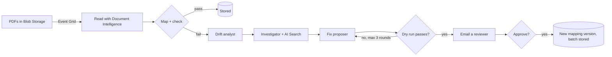

# foundry-land

An invoice-intake pipeline that notices when a supplier changes its invoice format, works out why, proposes a
fix, and waits for a person to approve it.

**Agents suggest, code verifies, a person decides.**

All data in this repo is fictional (a made-up dental clinic, "Example Dental Care Ltd").

## What it does

1. PDF invoices arrive in Blob Storage. Event Grid tells the app a new batch is ready.
2. Azure AI Document Intelligence reads each PDF.
3. A versioned **mapping** turns the printed labels into fields. Code then checks every invoice:
   required fields, read confidence, totals, and each procedure fee against the clinic's history.
4. If everything passes, the batch is stored. Done.
5. If something fails, three Azure AI Foundry agents work on it:
   - **Drift analyst**: what changed in the invoices?
   - **Investigator**: why? It searches the clinic's notices in Azure AI Search and quotes its source.
     Code checks every quote really appears in that notice.
   - **Fix proposer**: proposes a mapping change. Code applies it to the batch in a **dry run** and runs every
     check again. If the checks still fail, the agent tries again (at most 3 rounds), then a person is told.
6. A person gets an email, reviews the evidence in the web app, and approves or rejects.
   Approval saves a new mapping version and loads the batch. Every step goes into an audit trail.



## Stack

- **Server:** Node 24, TypeScript, Hono, Drizzle ORM on PostgreSQL, Zod
- **Web app:** React, Vite, Tailwind, shadcn/ui
- **Azure:** Container Apps, Blob Storage, Event Grid, Document Intelligence, AI Foundry (agents),
  AI Search, Database for PostgreSQL, Logic Apps (review email), Application Insights (OpenTelemetry)
- **Tests:** Vitest

On Azure the app has no keys: it uses a managed identity with one role per service. The deploy from GitHub
Actions signs in with OIDC, so no Azure password is stored either.

## Run it locally

You need Node 24, pnpm, PostgreSQL 16 on `localhost:5433`, and Azure resources for Document Intelligence,
Blob Storage, AI Search and AI Foundry. `scripts/azure-day1.sh` creates the first three plus Application
Insights; the Foundry project and its model deployment are made in the Foundry portal.

```sh
pnpm install
cp .env.example .env      # fill in the endpoints
pnpm db:migrate && pnpm seed
pnpm notices              # upload the clinic notices to AI Search
pnpm agents:setup         # create the three Foundry agents
pnpm data                 # generate the demo PDFs into out/batches
pnpm dev                  # API on :3000
pnpm dev:web              # web app on :5173
```

Drop the PDFs from `out/batches/live` into the web app to see the full flow.

## Tests

```sh
pnpm test                 # needs PostgreSQL on localhost:5433
pnpm test:live            # also calls the real Foundry agents
```

## Deploy

`scripts/azure-day2.sh` creates the Azure deployment one section at a time (Postgres, image, Container App,
roles, settings, Event Grid, budget). After that, every push to `main` runs the tests and deploys a new
revision (`.github/workflows/deploy.yml`).

`scripts/demo-ready.sh` resets a deployed copy to its starting point and checks that every part is working.

## Limits

- One app replica: the approval lock lives in the process.
- The Azure resources are created by scripts, not infrastructure-as-code.
- The app is protected by one shared password, which is enough for a demo but not for real users.
